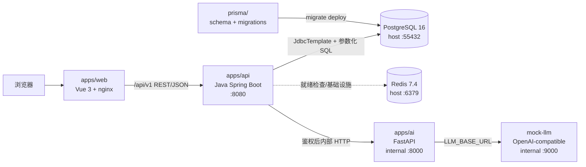

# Mini CRM

Mini CRM 是面向小微销售团队的客户线索管理与智能跟进系统。它把线索、销售状态、跟进记录、待办任务、统计报表和 AI 辅助建议放在一个轻量工作台中，帮助团队明确负责人、阶段、下一步动作和结果。

## 技术栈

- 前端：Vue 3、TypeScript、Vite、Pinia、Vue Router、Element Plus、ECharts、Axios
- 业务 API：Java 21、Spring Boot 3、Spring MVC、Bean Validation、Spring JDBC/JdbcTemplate、Springdoc OpenAPI、Maven
- AI 服务：Python 3.12、FastAPI、Pydantic；只提供 Java 服务调用的内部 HTTP 能力
- 数据模型：根目录 `prisma/` 维护 PostgreSQL schema 和不可变 migration；Prisma 不作为 Java API 运行时 ORM
- 数据库与基础设施：PostgreSQL 16、Redis 7.4、Docker Compose、nginx
- 共享代码：`packages/shared` 仅提供前端 TypeScript 类型和常量

## 系统架构



调用链是 `浏览器 -> nginx -> Java API -> PostgreSQL`；需要 AI 时，Java API 在完成认证、RBAC、组织隔离和敏感信息脱敏后，再调用 `FastAPI -> OpenAI-compatible LLM`。浏览器不直接访问 FastAPI。

## 一键启动

在仓库根目录执行：

```powershell
Copy-Item .env.example .env
docker compose up -d --build
```

访问 [http://localhost:8080](http://localhost:8080)。Compose 会等待 PostgreSQL 健康后执行根目录 Prisma migration，再启动 AI、Java API 和 Web。复制 `.env.example` 后，seed 默认关闭；若未提供 `.env`，Compose 的开发 fallback 为 `SEED_ON_START=true`。演示时可在 `.env` 设置 `SEED_ON_START=true` 后重新执行：

```powershell
docker compose up -d --build
```

常用命令：

```powershell
docker compose ps
docker compose logs -f api
docker compose down
```

默认服务端口：

| 服务 | 容器端口 | 宿主机端口 |
| --- | ---: | ---: |
| Web/nginx | 80 | 8080 |
| PostgreSQL | 5432 | 55432 |
| Redis | 6379 | 6379 |
| Java API | 8080 | Compose 内网 |
| FastAPI | 8000 | Compose 内网 |
| mock-llm | 9000 | Compose 内网 |

Compose 默认使用内部 `mock-llm`，不会产生外部模型费用。需要接入 DeepSeek 或其他 OpenAI-compatible 服务时，在 `.env` 中设置 `LLM_BASE_URL`、`LLM_API_KEY` 和 `LLM_MODEL`。

## 本地开发

基础依赖安装：

```powershell
pnpm install --frozen-lockfile
```

分别启动前端、Java API 和 AI 服务：

```powershell
pnpm -C apps/web dev
mvn -f apps/api/pom.xml spring-boot:run
cd apps/ai
python -m uvicorn main:app --reload --port 8000
```

本地 Java API 默认监听 `8080`，PostgreSQL 默认使用 `localhost:55432`，FastAPI 默认监听 `8000`。前端开发服务器通过 `VITE_DEV_API_TARGET` 将 `/api/v1` 代理到 Java API。

## 测试与验收

根目录常用检查：

```powershell
pnpm lint
pnpm typecheck
pnpm test
pnpm build
```

本阶段人工验收：

```powershell
mvn -f apps/api/pom.xml test
pnpm -C apps/web lint
pnpm -C apps/web build
python -m compileall apps/ai
docker compose config
```

真实流程还需要人工执行独立 PostgreSQL、真实 FastAPI + mock LLM、登录/RBAC、AI 降级和关键 E2E 验证。验收记录应补充到 `docs/report.md`，不能把静态测试数量当作覆盖率。

## 演示账号

seed 会创建一个演示组织和四个角色账号。汇报演示建议使用：

| 账号 | 邮箱 | 密码 | 权限 |
| --- | --- | --- | --- |
| admin | `admin@example.com` | `password123` | OWNER，全功能 |
| viewer | `viewer@example.com` | `password123` | SUPPORT，只读 |

演示账号仅用于本地 seed 数据，生产部署必须关闭 seed 并替换所有密钥。

## 目录结构

```text
.
├─ apps/
│  ├─ web/                  # Vue 3 前端和 nginx Dockerfile
│  ├─ api/                  # Java 21 + Spring Boot 唯一业务 API
│  └─ ai/                   # Python FastAPI 内部 AI 服务
├─ packages/
│  └─ shared/               # 前端共享 TypeScript 类型和常量
├─ prisma/
│  ├─ schema.prisma         # PostgreSQL 模型声明
│  ├─ migrations/           # 不可变数据库迁移
│  └─ seed.sql              # 本地演示数据
├─ infra/
│  ├─ docker/               # API、AI、migration、mock-llm 镜像
│  └─ nginx/                # Web 反向代理配置
├─ docs/                    # PRD、ER、API、架构、路线图、汇报和演示脚本
├─ archive/                 # 历史 NestJS 迁移参考，不参与运行时
├─ docker-compose.yml       # 本地服务编排
└─ package.json             # 根级 pnpm 和 Prisma CLI 脚本
```

更多契约见 [docs/api.md](docs/api.md)、[docs/er-diagram.md](docs/er-diagram.md) 和 [docs/architecture.md](docs/architecture.md)；阶段记录见 [docs/codex-log.md](docs/codex-log.md)；汇报材料见 [docs/report.md](docs/report.md) 和 [docs/demo-script.md](docs/demo-script.md)。
