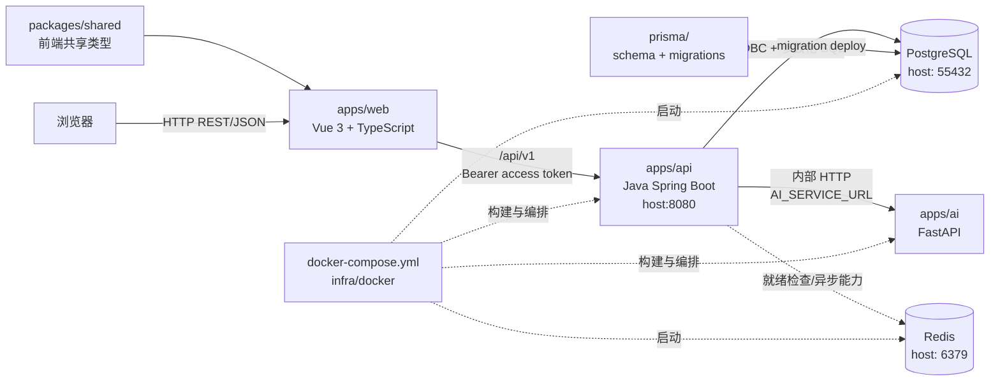

# Mini CRM 架构说明

## 总体架构

## 调用关系

1. 浏览器加载 `apps/web`，前端只使用 `VITE_API_BASE_URL` 访问 Java API。
2. Java API 是认证、RBAC、组织隔离、业务规则和统一错误包络的唯一入口。
3. Java API 使用 Spring JDBC/JdbcTemplate 访问 PostgreSQL；所有 SQL 参数化，数据库结构由根目录 Prisma migration 管理。
4. Java API 在完成用户认证、权限和资源归属校验后，才可通过 `AI_SERVICE_URL` 调用 FastAPI。浏览器不能直接访问 AI 服务。
5. FastAPI 只处理内部 AI 请求，不连接 PostgreSQL，不持有客户业务数据，不绕过 Java API 的权限边界。
6. Redis 由本地 Compose 提供缓存和异步能力所需的基础设施；未启用的队列逻辑不在本次目录整理中新增。
7. `packages/shared` 只为前端 TypeScript 提供共享类型和常量，不作为 Java 或 Python 的运行时依赖。

## 部署边界

- `docker-compose.yml` 使用 `infra/docker/api.Dockerfile` 和 `infra/docker/ai.Dockerfile` 构建 API、AI 服务。
- PostgreSQL 宿主机端口统一为 `55432`，Java 容器通过 Compose 服务名 `postgres` 访问。
- API 容器通过服务名 `ai` 访问 FastAPI；宿主机访问 AI 端口仅用于本地开发和调试。
- `archive/api-nest` 是历史迁移参考，不加入 pnpm workspace，不被 Compose 构建。
