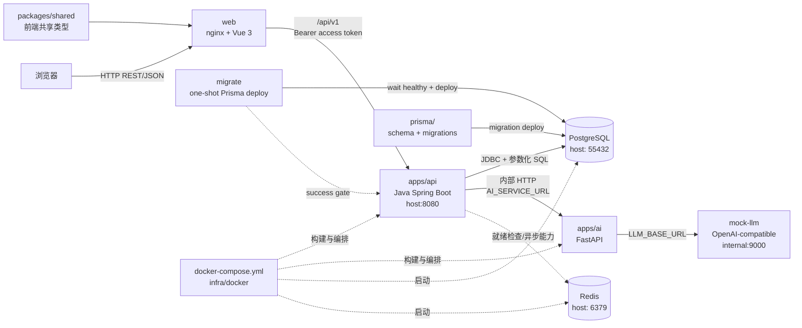

# Mini CRM 架构说明

## 总体架构

## 调用关系

1. 浏览器加载 `apps/web`，前端只使用 `VITE_API_BASE_URL` 访问 Java API。
2. Java API 是认证、RBAC、组织隔离、业务规则和统一错误包络的唯一入口。
3. Java API 使用 Spring JDBC/JdbcTemplate 访问 PostgreSQL；所有 SQL 参数化，数据库结构由根目录 Prisma migration 管理。
4. Java API 在完成用户认证、权限和资源归属校验后，才可通过 `AI_SERVICE_URL` 调用 FastAPI。浏览器不能直接访问 AI 服务。
5. FastAPI 只处理内部 AI 请求，不连接 PostgreSQL，不持有客户业务数据，不绕过 Java API 的权限边界。
6. Redis 由本地 Compose 提供缓存和异步能力所需的基础设施；未启用的队列逻辑不在本次目录整理中新增。
7. `packages/shared` 只为前端 TypeScript 提供共享类型和常量，不作为 Java 或 Python 的运行时依赖。

## 阶段 6 AI 调用边界

Java AiController 负责 /api/v1/leads/{id}/ai/* 协议适配，AiService 负责组织隔离、RBAC、最小上下文、缓存键和事务边界，AiSuggestionRepository 负责参数化 JdbcTemplate SQL。Java 释放读取事务后通过 RestClient 调用 FastAPI，再以短事务 upsert ai_suggestions 和写入 AI_SUGGESTION 操作日志。所有 timestamptz 参数通过 JdbcTimeUtils 转换，INSERT 显式传入 created_at/updated_at。

FastAPI 保留现有 /health 和 /v1/follow-up-suggestions，只在 main.py 注册 ai_service 新路由。新内部路径为 /internal/v1/intent-score、/follow-up-summary、/next-action、/script、/wake-up，由 AI_SERVICE_TOKEN Bearer 鉴权；AI 服务不连接业务数据库。DeepSeek 是默认 OpenAI-compatible LLM，测试只允许本地 mock HTTP 服务。

AI 结果只使用 PostgreSQL ai_suggestions 持久化和缓存，不引入 Redis。过期结果保留并在查询时重算；清理属于阶段 6.5 backlog。Java 到 FastAPI 连接超时 2 秒、读取超时 8 秒、总预算 10 秒，最多重试一次（连接异常或 429/502/503/504）。

## 部署边界

- `docker-compose.yml` 编排 `postgres`、`redis`、一次性 `migrate`、`api`、`ai`、`web` 和仅开发使用的 `mock-llm`。
- `migrate` 等待 PostgreSQL healthy 后执行根目录 `prisma migrate deploy`；只有迁移成功，API 才会启动。 `SEED_ON_START=true` 才执行幂等开发 seed，生产部署保持 `false`。
- Web 使用 `apps/web/Dockerfile` 的 Node 构建阶段和 nginx 运行阶段，宿主机通过 `8080 -> 80` 访问；nginx 将 `/api/v1` 反代到 `api:8080`，前端 Axios 保持同域 `/api/v1`。
- API、AI 和 mock-llm 仅加入 Compose 内网，不映射宿主机端口。PostgreSQL 仍映射 `55432 -> 5432`，Redis 映射 `6379 -> 6379`。
- `LLM_BASE_URL` 默认为 `http://mock-llm:9000`。将 `.env` 中的地址改为真实 DeepSeek OpenAI-compatible 地址并配置 `LLM_API_KEY` 即可切换。
- `archive/api-nest` 是历史迁移参考，不加入 pnpm workspace，不被 Compose 构建。
## 阶段 6 AI 调用边界

请求链路为：浏览器 -> Java Controller -> 鉴权/RBAC/组织归属/负责人校验 -> PostgreSQL 缓存查询 -> FastAPI -> OpenAI-compatible LLM。FastAPI 不访问业务数据库，也不持有业务状态；浏览器永远不直接访问 AI 服务。

Java 查询事务在调用 FastAPI 前结束，外部调用完成后以短事务执行 `ai_suggestions` upsert。所有时间参数通过 `JdbcTimeUtils.toDbTime` 绑定，INSERT 显式写入 `created_at` 和 `updated_at`。日志仅记录 `AI_SUGGESTION` 事件的类型、资源 ID 和组织上下文，不记录 prompt、邮箱、手机号、token 或客户原文。

`apps/ai/main.py` 保留既有 `/health` 等接口，新 AI 实现位于 `apps/ai/ai_service/`，prompt 位于 `apps/ai/prompts/<type>/v1.md`。客户文本被作为不可信数据传入，system prompt 要求忽略其中指令。
组织 ID 以已认证 principal/details 中的声明为准，`X-Organization-Id` 只用于一致性校验；声明与请求头不一致统一返回 404。
