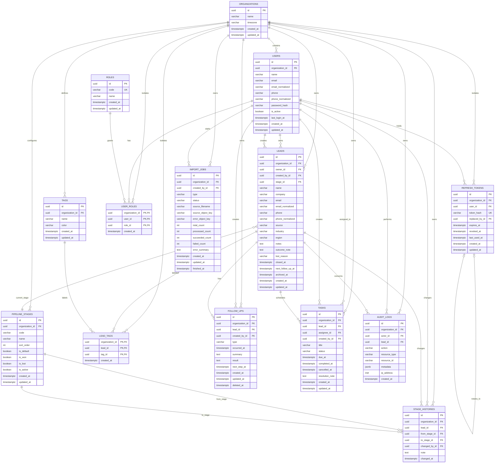

# Mini CRM ER Diagram

以下模型以单组织 MVP 为基线。租户业务实体使用 UUID 主键、与生命周期相符的时间字段（`created_at`、`updated_at` 或事件时间，必要时 `deleted_at`），并直接保存 `organization_id`；全局角色字典 `ROLES` 除外，关联表通过复合外键保证组织一致。字段名为数据库 `snake_case`，Java 使用 JDBC Repository 访问。

运行时说明：Java Spring Boot API 位于 `apps/api`，Python FastAPI 位于 `apps/ai`；本地 Java API 使用 `8080` 端口，PostgreSQL 宿主端口统一为 `55432`。以下实体、字段、关系和约束保持不变。

## 约束与索引

- `USERS` 使用 `(organization_id, email_normalized)`、`(organization_id, phone_normalized)` 唯一约束；规范化字段可为空，写入前统一去空格并做大小写或号码格式归一化。
- `USERS` 必须至少提供 `email`、`phone` 之一；`LEADS` 必须至少提供 `name`、`company` 之一，且 `source`、`stage_id`、`created_by_id` 必填。
- `REFRESH_TOKENS.token_hash` 全局唯一，只保存不可逆哈希；`replaced_by_id` 指向轮换后的 token。同一用户的活动 token 查询索引为 `(organization_id, user_id, revoked_at, expires_at)`。
- `USER_ROLES`、`LEAD_TAGS` 使用包含 `organization_id` 的联合主键。业务关联使用 `(organization_id, id)` 复合外键，禁止把不同组织的用户、阶段、标签、线索或任务关联起来。
- `PIPELINE_STAGES` 在组织内对 `code`、`sort_order` 唯一；部分唯一索引保证每个组织至多一个活动的 `is_default=true` 阶段，服务层事务保证至少一个；`is_won` 与 `is_lost` 不得同时为真。
- `TAGS` 在组织内对规范化后的名称唯一。删除线索或标签时仅级联删除 `LEAD_TAGS`；跟进、阶段历史和审计数据不得级联物理删除。
- `LEADS` 建立 `(organization_id, owner_id, updated_at)`、`(organization_id, stage_id, updated_at)`、`(organization_id, next_follow_up_at)`、`(organization_id, archived_at)` 索引；手机号和邮箱去重使用与用户相同的规范化列及组织内部分唯一索引。
- 线索进入赢单或输单阶段时必须写入 `closed_at`、`outcome_note`；进入输单阶段还必须写入 `lost_reason`，离开终态时三者清空。阶段变更与 `STAGE_HISTORIES` 新记录在同一事务提交。
- `FOLLOW_UPS` 建立 `(organization_id, lead_id, occurred_at DESC)` 索引；删除接口只写 `deleted_at`。`TASKS` 建立 `(organization_id, assignee_id, status, due_at)` 和 `(organization_id, lead_id, created_at DESC)` 索引。
- `STAGE_HISTORIES` 建立 `(organization_id, lead_id, changed_at DESC)` 索引；`AUDIT_LOGS` 建立 `(organization_id, created_at DESC)`、`(organization_id, actor_id, created_at DESC)`、`(organization_id, resource_type, resource_id)` 索引。
- `IMPORT_JOBS` 建立 `(organization_id, created_by_id, created_at DESC)` 和 `(organization_id, status, created_at)` 索引；原文件和错误文件只存对象键，不在数据库保存 CSV 内容。
- 状态和类型使用 PostgreSQL 枚举，并由 Java 枚举映射：任务状态 `pending|completed|cancelled`，导入状态 `queued|running|completed|failed`，跟进类型 `call|wechat|email|meeting|other`。逾期不是持久化状态，而是 `status=pending AND due_at<now()` 的派生结果。
- `TASKS` 使用 CHECK 约束保证 `completed` 仅设置 `completed_at`、`cancelled` 仅设置 `cancelled_at`、`pending` 两者均为空；导入计数字段不得为负，且 `succeeded_count + failed_count <= processed_count <= total_count`。
- 阶段历史和审计日志只追加，不提供普通用户更新或删除接口；保留策略由后续合规需求另行定义。
