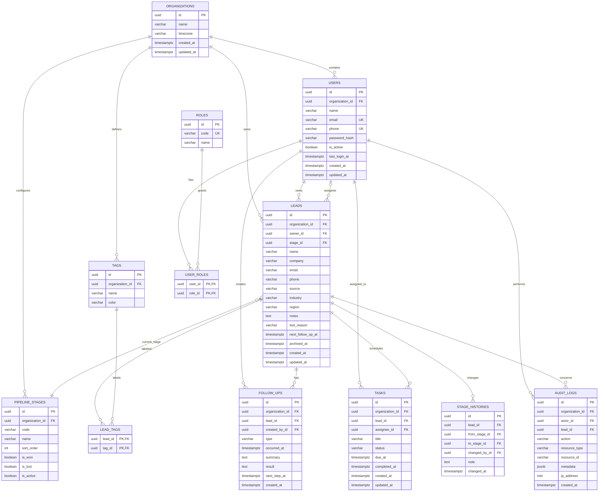

# Mini CRM ER Diagram

以下模型以单组织 MVP 为基线。所有业务表均使用 UUID 主键、`created_at`/`updated_at`（必要时 `deleted_at`）并通过 `organization_id` 做组织隔离。字段名为数据库 `snake_case`；Prisma 模型名可使用 PascalCase。

## 约束与索引

- `USERS` 在组织内对 `email`、`phone` 做唯一约束；空值允许多个，规范化后再比较。
- `PIPELINE_STAGES` 在组织内对 `code` 唯一；只能有一个活动默认顺序位置。
- `LEAD_TAGS` 使用联合主键；删除线索或标签时按业务决定级联，审计记录不可级联删除。
- `LEADS` 建议索引 `(organization_id, owner_id, updated_at)`、`(organization_id, stage_id)`、`(organization_id, next_follow_up_at)`。
- `FOLLOW_UPS`、`TASKS` 的列表查询必须带 `organization_id`；禁止仅凭外部 ID 查询。
- 阶段历史和审计日志只追加，不提供普通用户更新接口；保留策略由后续合规需求另行定义。
