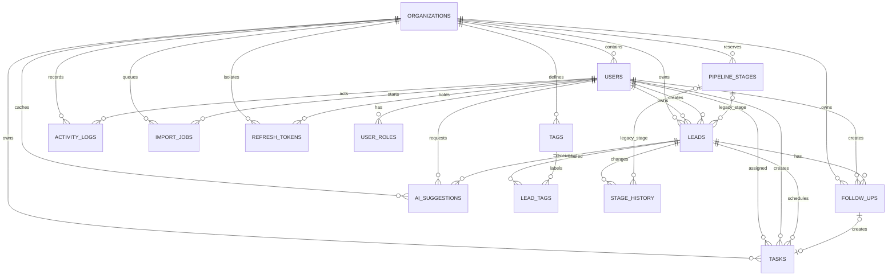

# Mini CRM 数据模型

## 事实来源

数据库结构以根目录 `prisma/schema.prisma` 和 `prisma/migrations/` 为准，migration 一经应用不得修改。Java API 使用 Spring JDBC/JdbcTemplate 访问同一套 PostgreSQL 表，不使用 Prisma Client。

本文只描述当前运行时依赖的实体、关系和约束。`pipeline_stages`、`stage_id` 以及阶段历史中的旧 stage 字段保留给阶段 3.5，阶段 3 及以后业务状态以 `leads.status` 和 `stage_history.from_status/to_status` 为准。

## 当前实体关系



## 核心表

| 表 | 作用 | 关键字段 |
| --- | --- | --- |
| `organizations` | 组织隔离和时区 | `id`, `name`, `slug`, `timezone`, `is_active` |
| `users` | 组织成员和认证主体 | `organization_id`, `email`, `phone`, `password_hash`, `is_active` |
| `user_roles` | 成员角色 | `user_id`, `code`，值为 `OWNER/ADMIN/SALES/SUPPORT` |
| `refresh_tokens` | refresh token 轮换和撤销 | `token_hash`, `family_id`, `expires_at`, `revoked_at`, `replaced_by_id` |
| `leads` | 客户线索主表 | `organization_id`, `status`, `owner_id`, `source`, `closed_at` |
| `tags` / `lead_tags` | 线索标签 | 组织内规范化标签名唯一 |
| `follow_ups` | 跟进记录 | `lead_id`, `type`, `occurred_at`, `deleted_at`, `next_step_at` |
| `tasks` | 下一步待办 | `lead_id`, `assignee_id`, `due_at`, `status` |
| `stage_history` | 线索状态变更历史 | `lead_id`, `from_status`, `to_status`, `actor_id`, `created_at` |
| `activity_logs` | 操作审计 | `actor_id`, `action`, `resource_type`, `resource_id`, `metadata` |
| `import_jobs` | CSV 导入持久化队列 | `status`, `processed`, `succeeded`, `failed`, `storage_key` |
| `ai_suggestions` | AI 建议结果和缓存 | `lead_id`, `suggestion_type`, `input_hash`, `prompt_version`, `expires_at` |
| `pipeline_stages` | 旧的可配置阶段结构 | 阶段 3.5 预留，当前固定状态运行时不读写 |

## 线索状态机

固定状态值：

```text
new -> contacted -> qualified -> proposal -> negotiation -> won
                                                       └-> lost
```

- `SALES` 只能推进自己负责且未归档线索的正向下一状态。
- `OWNER`、`ADMIN` 可以将未归档线索调整到任意不同状态，也可以将终态重新打开。
- `SUPPORT` 只读，不能改变状态。
- 进入 `won` 或 `lost` 必须写入 `closed_at` 和 `outcome_note`；进入 `lost` 还必须写入 `lost_reason`。
- 从终态重新打开时清空终态字段，并指定非终态目标；未指定时服务层默认回到 `negotiation`。
- 重复状态、归档线索迁移和不符合角色矩阵的迁移返回 `409 STAGE_INVALID_TRANSITION`。
- 状态更新、`stage_history` 追加和审计日志在同一事务提交。

## 关键约束

- 所有业务表通过 `organization_id` 做组织隔离；跨组织或不可见资源统一按 `404 RESOURCE_NOT_FOUND` 处理。
- 线索必须至少填写 `name` 或 `company`，并且必须填写 `source`；同组织内规范化邮箱或手机号重复时返回 `409 LEAD_DUPLICATE`。
- 邮箱规范化为去首尾空白并使用 `Locale.ROOT` 小写；手机号去除常见分隔符并保留合法前导 `+`。
- `follow_ups` 使用软删除；时间线保留已删除跟进并标记删除状态，普通跟进列表过滤已删除记录。
- `tasks.status` 为 `pending|completed|cancelled`；逾期是 `pending AND due_at < now()` 的派生查询，不单独持久化。
- `import_jobs.status` 为 `queued|running|completed|failed`，Worker 通过 `FOR UPDATE SKIP LOCKED` 领取任务。
- `ai_suggestions` 的缓存键是组织、线索、类型、输入哈希和 prompt 版本；TTL 到期后查询视为未命中并重算，阶段 6.5 才负责定期清理。
- 数据库列使用 `snake_case`，Java 和 API JSON 使用 `camelCase`；`timestamptz` 在 API 侧使用 UTC ISO 8601，JdbcTemplate 绑定通过 `JdbcTimeUtils` 转换。
- 阶段历史和审计日志只追加，不提供普通更新或删除接口。

## 当前 schema 维护风险

`prisma/schema.prisma` 末尾仍保留一段重复的 AI 枚举和模型声明，和 `20260924000000_ai_suggestions` migration 及 Java 运行时字段不完全一致。阶段 10 不修改 Prisma 或 migration；在下一次可修改 schema 的变更前，应先删除重复声明并执行 `prisma validate`，确保 schema、migration、Java SQL 和 API 契约重新统一。
