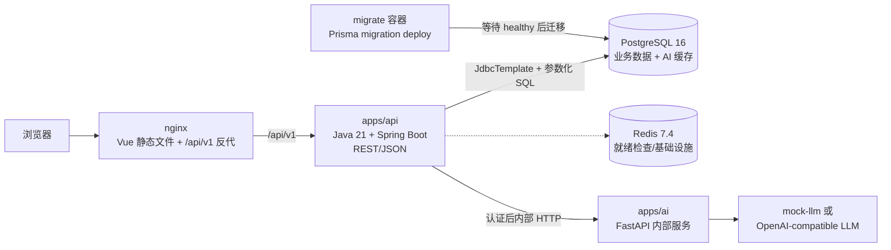

# Mini CRM 项目汇报

## 1. 项目概述

Mini CRM 面向 5 到 30 人的小微销售团队，提供从线索录入、负责人分配、销售状态推进、跟进记录、待办提醒到统计复盘的一体化管理，并在客户详情中提供意向评分、跟进摘要、下一步建议、话术生成和沉默唤醒等 AI 辅助能力。系统的核心价值是让团队随时知道客户在哪里、谁负责、下一步做什么，以及哪些机会正在被遗漏。

## 2. 用户画像与付费价值

| 用户 | 使用场景 | 付费价值 |
| --- | --- | --- |
| 小微企业负责人 | 查看团队漏斗、负责人表现、赢单和流失情况 | 用较低学习成本获得可追踪的销售管理能力 |
| 销售主管 | 分配线索、检查跟进、处理逾期任务、复盘渠道 | 减少线索遗漏，提升过程管理和团队可见性 |
| 一线销售 | 管理自己的线索、记录沟通、生成下一步建议 | 减少重复记录和话术准备时间 |
| 客服/支持成员 | 查看组织范围数据和报表 | 在只读权限下共享业务上下文，不增加误操作风险 |

团队愿意付费的原因不是“多一个联系人列表”，而是获得组织隔离、角色权限、过程审计、统一状态机、提醒和复盘能力。对没有专职销售运营人员的小团队来说，这些能力可以替代表格、聊天记录和个人备忘录之间的人工同步。

## 3. 系统架构



调用链：

1. 浏览器访问 nginx 提供的 Vue 应用。
2. 前端只调用同域 `/api/v1`，nginx 反向代理到 Java API。
3. Java API 负责 JWT、RBAC、组织隔离、DTO 校验、业务规则、审计和统一错误包络。
4. Java 使用 JdbcTemplate 访问 PostgreSQL，所有 SQL 参数化，数据库结构由根目录 Prisma migration 管理。
5. Java 完成权限和资源归属校验后，提取最小必要上下文并调用 FastAPI。
6. FastAPI 只负责 AI 输入输出校验和模型调用，不访问业务数据库。
7. AI 结果由 PostgreSQL `ai_suggestions` 持久化并承担缓存，Redis 不承担 AI 缓存。

## 4. 数据模型与线索状态机

核心表包括：

- `organizations`、`users`、`user_roles`、`refresh_tokens`：组织、成员、角色和 token 生命周期。
- `leads`、`tags`、`lead_tags`：线索、标签和多对多关联。
- `follow_ups`、`tasks`：跟进记录、下一步任务和任务状态。
- `stage_history`、`activity_logs`：状态历史和操作审计。
- `import_jobs`：CSV 导入的持久化队列。
- `ai_suggestions`：AI 建议结果、输入哈希、prompt 版本和 TTL。
- `pipeline_stages`：阶段 3.5 预留的旧可配置阶段表，当前固定状态运行时不读写。

线索固定状态：

```text
new -> contacted -> qualified -> proposal -> negotiation -> won
                                                       └-> lost
```

进入 `won` 或 `lost` 必须填写结果说明；进入 `lost` 还必须填写输单原因。销售只能推进自己负责的未归档线索，管理员可纠正或重新打开。状态、状态历史和审计日志在同一事务提交。

## 5. 功能清单

### 认证与组织

- 邮箱/手机号登录、access token、refresh token 轮换和退出。
- `OWNER`、`ADMIN`、`SALES`、`SUPPORT` 四类角色。
- 组织隔离、统一 401/403/404 语义、登录和写操作审计。
- 成员新增、编辑、启用/停用和最后管理员保护。

### 线索管理

- 线索列表分页、关键词、状态、负责人、来源、日期、归档筛选和排序。
- 新建、编辑、详情、归档/恢复、单条分配和批量分配。
- 联系方式规范化和组织内重复检测。
- CSV 异步导入、任务状态查询和受限 CSV 导出。

### 跟进与任务

- 电话、微信、邮件、会议和其他跟进类型。
- 跟进软删除、下一步时间、自动任务幂等和负责人无效跳过日志。
- 今日任务、全部任务、逾期查询、完成、取消和终态保护。
- 线索时间线聚合阶段历史、跟进和任务事件。

### 统计与 AI

- 工作台总览、今日任务、近期线索。
- 漏斗、渠道、销售排名、趋势、流失原因和响应时长统计。
- AI 意向评分、跟进摘要、下一步建议、话术生成和沉默唤醒。
- AI 权限、超时、有限重试、PostgreSQL 缓存和 mock LLM 测试链路。

### 前端体验

- Vue 3 + Element Plus 桌面端布局。
- 列表、表单、看板、详情、时间线、统计图表、设置和无权限页面。
- 加载、空态、错误、重试和权限不足状态。

## 6. 关键设计决策

1. Java Spring Boot 是唯一浏览器可访问的业务 API，FastAPI 只提供内部 AI 能力。
2. Java 数据访问统一使用 JdbcTemplate 和参数化 SQL，禁止引入 ORM。
3. Prisma 只维护 schema 和不可变 migration，不作为 Java API 运行时依赖。
4. 所有业务资源必须绑定 `organization_id`，跨组织和不可见资源统一返回 404。
5. 角色固定为 `OWNER/ADMIN/SALES/SUPPORT`，`SUPPORT` 是只读角色，不把后台 Worker 当成用户角色。
6. 线索运行时使用固定 `LeadStatus` 状态机，同时保留旧 pipeline 表供阶段 3.5 使用。
7. 线索状态、状态历史和审计日志在同一事务提交，避免出现“状态变了但历史没写”的不一致。
8. 联系方式使用规范化字段和 PostgreSQL 组织级唯一索引，应用层提示与数据库约束共同防止重复。
9. 跟进删除采用软删除，时间线保留删除事件，普通列表不展示已删除内容。
10. CSV 导入使用持久化 `import_jobs` 和 `FOR UPDATE SKIP LOCKED`，支持重启恢复并避免请求线程执行大批量导入。
11. CSV 导出限制最大行数并进行公式注入转义，减少把业务数据直接打开为电子表格公式的风险。
12. 所有 `timestamptz` 绑定显式转换为 UTC `OffsetDateTime`，不依赖 JDBC 驱动对 `Instant` 的隐式推断。
13. 统计统一使用 UTC 半开区间，赢单依据当前状态和 `closed_at`，响应时长明确标注为运营代理指标。
14. AI 调用由 Java 先做权限和脱敏，FastAPI 不连业务库；缓存由 PostgreSQL 承担，过期结果查询时重算。
15. Compose 使用 migration gate：PostgreSQL healthy 且 migration 成功后才启动 Java API。
16. 本地默认使用 mock LLM，避免开发和测试误调用付费模型。

## 7. 用 Codex 协作的过程复盘

### 分阶段工作流

项目按阶段 0 到 10 推进，每阶段先明确目标、边界、验收命令和文档契约，再实现代码。阶段 3 完成 Java 重构，阶段 4 完成跟进/任务/时间线，阶段 5 完成统计，阶段 6 完成 AI，阶段 7/8 完成前端，阶段 9 完成 Compose 联调，阶段 10 收敛文档和汇报。

### 契约先行

先维护 PRD、ER、API 和 ADR，再将同一字段对齐到 Prisma、Java DTO、SQL、共享 TypeScript 和 Vue 页面。角色、路由前缀、端口、状态值、错误码和时间语义都经过多端核对，减少“后端能跑但前端解释不同”的问题。

### 真实验证的重要性

Mock 测试能够验证调用次数、SQL 片段和权限分支，但不能发现 PostgreSQL 的 NOT NULL、唯一约束、外键、时间类型和事务行为。因此 FollowUp、Task、Lead、统计和 AI 缓存关键路径都需要独立 PostgreSQL 或 Compose 环境再次验证。

### 踩过的坑与解决方式

| 坑 | 解决方式 |
| --- | --- |
| 初始运行时是旧 NestJS，最终架构要求 Java | 将 Java 服务迁移到 `apps/api`，NestJS 归档到 `archive/api-nest` |
| 旧文档使用 `/api` 和 3000 端口 | 统一为 `/api/v1` 和 Java `8080`，更新前端 proxy、Compose 和文档 |
| Prisma schema/migration 路径分散 | 将运行时 schema 和 migration 收敛到根目录 `prisma/` |
| Java 多构造函数导致 Spring 无法选择注入构造函数 | 为实际注入构造函数补 `@Autowired` |
| 直接绑定 `Instant` 导致 PostgreSQL 无法推断 SQL 类型 | 统一使用 `JdbcTimeUtils` 转换为 UTC `OffsetDateTime` |
| FollowUp INSERT 漏写 `updated_at` | 真实 PostgreSQL 验证后补齐所有实际存在的 NOT NULL 时间列 |
| Mock JdbcTemplate 看不出数据库约束错误 | 对关键写路径增加真实 PostgreSQL 手工验证要求 |
| 自定义 CSV 解析难以覆盖引号、换行和 BOM | 改用 Apache Commons CSV 并在边界处理 UTF-8 BOM |
| 导出数据可能触发电子表格公式 | 对 `=,+,-,@` 开头的值做公式注入转义 |
| 销售越权查询可能泄露组织信息 | 区分组织内无权限的 403 与跨组织资源的 404 |
| 阶段历史和当前状态来源不一致 | 用固定 `LeadStatus` 作为运行时 authority，旧 pipeline 只保留兼容结构 |
| AI 服务可能被浏览器绕过 Java 直接访问 | FastAPI 仅暴露内部端点，并要求 `AI_SERVICE_TOKEN` |
| AI 供应商不可用时容易伪造成功结果 | 缓存 miss 时明确返回 503，不静默生成假结果 |
| AI 请求可能记录客户原文或联系方式 | Java 侧只提取最小上下文并脱敏，日志只留非 PII metadata |
| 测试 Worker 后台轮询真实数据库制造噪音 | 测试 profile 关闭 ImportJobWorker，生产默认按配置启用 |

### 迭代与维护思路

- API、ER、Prisma、Java、共享类型和前端页面发生字段变更时，按契约清单同步更新。
- migration 只新增、不修改已应用文件；所有 schema 变更先记录 ADR。
- 每个关键写库流程同时保留单测和真实 PostgreSQL 验证记录。
- 新增 AI 能力必须先明确输入脱敏、输出校验、超时、重试、缓存和降级。
- 统计接口先写清 cohort、时间范围、归属和空值口径，再实现 SQL。
- 归档文档保留历史事实，但 README、API、ER 和架构说明只描述当前运行时。

## 8. 代码量统计

以下为人工统计结果（PowerShell 逐模块计数，排除 `node_modules`、`target`、`dist`、`.m2`、`archive`、`.git`）：

| 模块 | 文件数 | 代码行数 |
| --- | ---: | ---: |
| `apps/api` (Java) | 113 | 6,713 |
| `apps/web` (Vue+TS) | 83 | 4,403 |
| `apps/ai` (Python) | 12 | 467 |
| `packages/shared` (TS) | 10 | 600 |
| `prisma` (Schema+SQL) | 5 | 1,104 |
| `infra` (Docker/nginx) | 3 | 59 |
| 合计 | 226 | 13,346 |

排除口径：`node_modules`、`target`、`dist`、`.m2`、`archive`、`.git`。

## 9. 测试与验收

### 当前测试文件和静态数量

截至 2026 年 9 月 26 日，当前运行时代码的静态盘点为：

- Java：32 个测试文件，68 个 `@Test` 方法。
- Python AI：2 个测试文件，8 个 pytest/unittest 测试方法。
- Web：`package.json` 配置了 Vitest 的 `passWithNoTests`，当前未发现独立 Web 测试文件。
- `archive/api-nest/test` 的 2 个历史测试文件不计入当前运行时统计。

Java 测试按领域覆盖认证、权限、时间转换、线索状态机、线索 HTTP 契约、跟进、任务、导入、导出、统计和 AI；其中包含独立 PostgreSQL 条件测试和 Java/FastAPI/mock-LLM 链路测试。静态测试数量不等于覆盖率，覆盖率需要人工运行测试工具后补充。

### 人工验收清单

```powershell
mvn -f apps/api/pom.xml test
pnpm -C apps/web lint
pnpm -C apps/web build
python -m compileall apps/ai
docker compose config
```

必须追加：

- 使用独立数据库 `mini_crm_test` 执行统计和 AI PostgreSQL 集成测试。
- 使用 Compose 启动 PostgreSQL、Redis、mock-llm、FastAPI、Java API 和 nginx。
- 验证 admin 登录、viewer 只读、Sales 负责人边界、跨组织 404、未认证 401。
- 验证 AI 缓存命中、force refresh、超时、429/503 降级和浏览器无法直连 FastAPI。
- 验证 FollowUp 创建后的任务幂等、软删除重算、CSV 导入/导出和时间线。
- 对统计核心查询采集 `EXPLAIN (ANALYZE, BUFFERS)`，以真实证据决定是否需要新增 migration。

本阶段不声称人工验收已经完成；执行结果应由人工补回本报告。

## 10. 已知限制与统一 backlog

### 阶段 3.5：可配置 Pipeline 阶段

- 恢复 pipeline stage 配置 API、阶段排序和阶段变更交互。
- 将现有 `pipeline_stages`、`stage_id` 和旧 stage history 字段重新接入运行时。
- 在固定 `LeadStatus` 与可配置阶段之间定义兼容 ADR。

### 阶段 4.5：质量与体验加固

- Scheduler 并发集成测试。
- Testcontainers 或真实 PostgreSQL E2E。
- 完整认证链路 MockMvc E2E。
- Timeline metadata JSON 对象序列化修复。
- 评估 `tasks/today` 是否扩展为未来 3 天。
- ImportJobWorker 测试 profile 和真实数据库噪音治理。
- Timeline cursor 分页，替换当前 offset 分页。
- 完成 `LeadView` 前端启用和更多页面级测试。

### 阶段 5.5：金额报表

- 先定义金额字段、币种、数据来源、退款/折扣和统计口径。
- 再新增 schema、migration、API 和前端报表。
- 在金额字段明确前不承诺成交额、客单价、ROI 或渠道成本。

### 阶段 6.5：AI 结果定期清理

- 按保留策略定期删除过期 `ai_suggestions`。
- 评估删除任务的批量大小、锁竞争、审计和失败重试。
- 清理任务不能影响缓存 miss 后的重新生成。

### 阶段 7.5：前端质量加固

当前 `roadmap.md` 和 `codex-log.md` 没有形成独立的 7.5 backlog 条目。本阶段先归档为待规划项：补充页面级测试、关键流程 E2E、移动窄屏检查、无障碍检查和前端错误监控。

### 阶段 8.5：发布质量加固

当前 `roadmap.md` 和 `codex-log.md` 没有形成独立的 8.5 backlog 条目。本阶段先归档为待规划项：补充 CI 质量门禁、镜像漏洞扫描、备份恢复演练、生产配置审查、发布回滚和运行手册。

### 当前契约风险

- `prisma/schema.prisma` 末尾重复的 AI 枚举和模型声明已在阶段 10 清理（commit `fix(prisma): remove duplicated AiSuggestion declarations`），与已应用的 AI migration、Java SQL 保持一致。
- `apps/ai/ai_service/models.py` 是当前内部 FastAPI 路由使用的 `customer_text`/`recent_follow_ups` 契约，而 `schemas.py` 和部分旧测试仍保留 `context` 风格模型。下一次 AI 变更前应统一 Python 模型、路由、Java DTO、共享 TS 类型和测试。

## 11. 下一步计划

1. 完成强制验收命令和 Compose 一键启动验证。
3. 在 `mini_crm_test` 完成统计、AI 和关键写库流程的真实 PostgreSQL 验证。
4. 统一 FastAPI `models.py`、`schemas.py`、路由和现有 AI 测试的请求/响应契约。
5. 先清理 `prisma/schema.prisma` 重复的 AI 声明，再进行下一次数据库相关变更。
6. 根据演示反馈决定是否优先推进阶段 3.5 pipeline、阶段 5.5 金额报表或阶段 6.5 AI 清理。
7. 将关键登录、权限、线索、跟进、任务和 AI 流程纳入可重复的 E2E。
